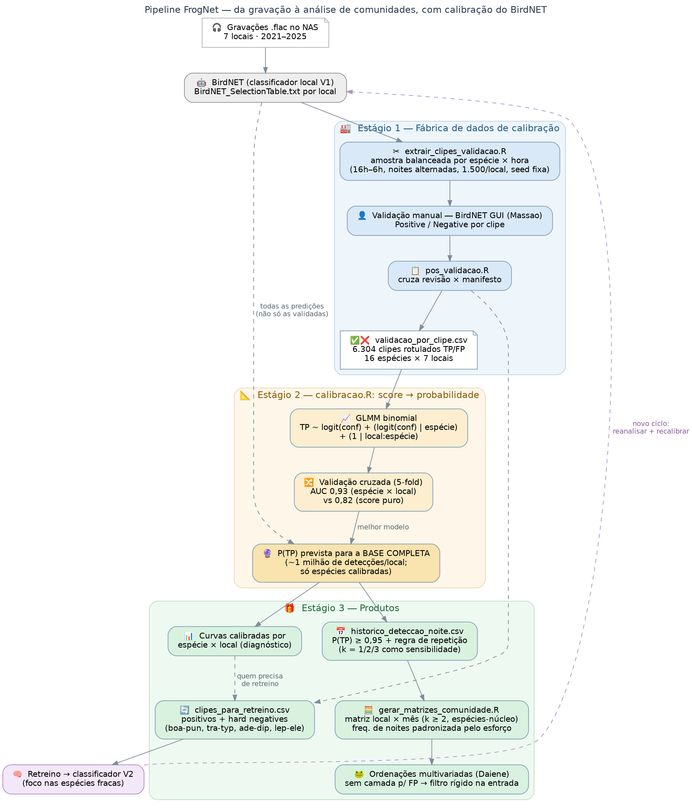

# Amostragem, validação e calibração de predições do BirdNET para PAM de anuros

[](https://doi.org/10.5281/zenodo.22696210)
[](LICENSE)

> **EN** — R pipeline to (1) build manually-validatable clip sets from BirdNET
> custom-classifier predictions in passive acoustic monitoring (PAM), (2) calibrate
> confidence scores into probabilities of true detection with a hierarchical GLMM
> (species and site × species effects, cross-validated), and (3) turn calibrated
> detections into nightly detection histories and effort-standardized community
> matrices ready for multivariate analyses. Developed for the FrogNet project
> (Pantanal/Cerrado, Brazil), but any BirdNET custom classifier output works.

Pipeline em R, em **três estágios**, para transformar as predições de um classificador
customizado do BirdNET em dados prontos para análise, no contexto de monitoramento
acústico passivo (PAM). Desenvolvido para o projeto **FrogNet** (anuros do Pantanal e
Cerrado, MS, Brasil) — em primeira instância para a tese de doutorado da Daiene (UFMS)
e para o pipeline de validação do FrogNet — mas desenhado para funcionar com a saída
de qualquer classificador customizado do BirdNET.



## Estágio 1 — Fábrica de dados de validação

**`extrair_clipes_validacao.R`** lê as `BirdNET_SelectionTable.txt` (formato Raven, uma
tabela concatenada por local), seleciona as *N* predições de maior confidence por
local × espécie × noite × hora, aplica o desenho amostral configurado e corta os clipes
`.wav` diretamente dos áudios originais, organizando **uma pasta por espécie** — pronta para
a aba *review* do BirdNET GUI — mais um zip por espécie ("pacotes" de validação leves para
download) e um `manifesto_clipes.csv` que liga cada clipe a local, espécie, data, noite,
hora, rank, confidence e áudio de origem.

O desenho amostral é todo declarativo, no bloco `config` do topo do script:

| Parâmetro | O que faz |
|---|---|
| `n_top` | Predições de maior confidence por local × espécie × noite × hora (padrão 2) |
| `conf_minima` | Confidence mínima para uma predição ser candidata (padrão 0.1) |
| `hora_inicio` / `hora_fim` | Janela de horas; cruzando a meia-noite (ex. 16 → 6), o agrupamento passa a ser por **noite** — a madrugada conta como a noite da véspera |
| `alternar_dias` | "Dia sim, dia não" sobre as noites, ancorado na 1ª noite de cada local |
| `meta_total` | Meta total de clipes por local, repartida de forma **balanceada** entre as espécies (water-filling: raras entram inteiras, o excedente é redistribuído) |
| `balancear_por_hora` | Round-robin entre as horas dentro de cada espécie (cobre o ciclo diel) |
| `especies` | Restringe a uma lista de códigos de espécie |
| `data_inicio` / `data_fim` | Janela de datas (ex.: período de um data logger) |
| `locais`, `max_por_especie`, `remap_de`/`remap_para`, `simular` | Filtro de locais, limite simples por espécie, remapeamento de caminhos e modo ensaio (só manifesto, sem cortar áudio) |

Todos os sorteios usam semente fixa, então re-execuções selecionam exatamente o mesmo
conjunto — e o script é **idempotente**: clipes já cortados são pulados, de modo que uma
rodada interrompida continua de onde parou. Áudios ausentes ou com erro de leitura não
derrubam a rodada; ficam marcados no manifesto (`status`).

**`pos_validacao.R`** fecha o ciclo depois da revisão manual no BirdNET GUI: classifica cada
clipe pelo caminho (subpastas `Positive`/`Negative`, padrões configuráveis), cruza com o
manifesto e produz (1) o veredito clipe a clipe (`validacao_por_clipe.csv`), (2) a precisão
por espécie × faixa de confidence (+ figura), (3) o menor threshold de confidence que atinge
uma precisão-alvo por espécie, (4) a tabela de presença confirmada por noite e (5) a lista
de clipes positivos para o retreino do classificador.

## Estágio 2 — Calibração: score → probabilidade

**`calibracao.R`** usa os clipes rotulados TP/FP para ajustar e comparar, por validação
cruzada (5-fold, AUC), uma família de modelos de calibração — de uma regressão logística
simples em logit(confidence) até um GLMM binomial com slopes aleatórios por espécie e
intercepto por local:espécie:

```
tp ~ logit(conf) + (logit(conf) | espécie) + (1 | local:espécie)
```

A estrutura hierárquica importa porque o mesmo confidence score corresponde a
probabilidades de acerto muito diferentes conforme a espécie e o local. Com o melhor
modelo, o script prevê P(verdadeiro positivo) para **todas** as detecções da base
completa (não só as validadas), restrita às espécies presentes no conjunto de
calibração, e agrega por espécie × local × noite com uma regra de repetição
(≥ k detecções com P(TP) ≥ `p_min` na noite; k = 1/2/3 exportados como sensibilidade).
Saídas: `deteccoes_calibradas_<local>.csv`, `historico_deteccao_noite.csv`,
`resumo_deteccao_especie_local.csv`, curvas calibradas por espécie × local (diagnóstico)
e o modelo ajustado (`.rds`).

## Estágio 3 — Matrizes de comunidade

**`gerar_matrizes_comunidade.R`** converte o histórico calibrado em matrizes de
comunidade prontas para ordenações multivariadas (PCoA/NMDS/RDA). Como essas análises
não têm nenhuma camada que absorva falsos positivos, o filtro de entrada é rígido e
explícito no config: regra de repetição (`k_min`, padrão 2), lista de espécies-núcleo
(com calibração confiável em todos os locais) e esforço mínimo por célula. O valor de
cada célula é a **frequência de noites com detecção padronizada pelo esforço**
(noites com detecção / noites gravadas no local × mês), o que corrige diferenças de
início e falhas de gravador entre locais. Saídas: matriz de frequências, matriz de
contagens e tabela de esforço por local × mês.

**`diagrama_fluxo_validacao.R`** e **`diagrama_pipeline_calibracao.R`** geram os
fluxogramas (DiagrammeR).

## Requisitos

R ≥ 4.2 (Windows, macOS ou Linux) e:

```r
install.packages(c("dplyr", "readr", "stringr", "purrr", "tidyr",
                   "av", "zip",          # estágio 1 (av embute o ffmpeg)
                   "ggplot2",            # figuras
                   "lme4", "pROC"))      # estágio 2 (GLMM + AUC)
```

## Uso

1. Edite o bloco `config` no topo de `extrair_clipes_validacao.R` (caminhos, desenho
   amostral). A tabela de seleção deve ter as colunas padrão do BirdNET/Raven:
   `Begin Time (s)`, `End Time (s)`, `Species Code`, `Confidence`, `Begin Path`,
   `File Offset (s)`; os áudios devem seguir o padrão `..._AAAAMMDD_HHMMSS` no nome.
2. Rode primeiro com `simular = TRUE` e confira o manifesto; depois `simular = FALSE`
   para cortar de verdade.
3. Valide os clipes no BirdNET GUI (aba *review*).
4. Aponte `pos_validacao.R` para a pasta revisada e rode — isso gera os
   `validacao_por_clipe.csv`.
5. Aponte `calibracao.R` para os `validacao_por_clipe.csv` e para as tabelas de
   predição completas e rode (a comparação de modelos e as curvas dizem se a
   estrutura hierárquica está ajudando).
6. Ajuste `k_min` e as espécies-núcleo em `gerar_matrizes_comunidade.R` e rode para
   obter as matrizes de comunidade.

Exemplo de uso no FrogNet (2026): 9.000 clipes de 6 locais cortados em ~8 min/local;
6.304 clipes validados (16 espécies × 7 locais); AUC do modelo hierárquico 0,93 vs
0,82 do score puro; ~3,15 milhões de detecções calibradas; matrizes local × mês com
10 espécies-núcleo e regra k ≥ 2 com P(TP) ≥ 0,95.

## Estrutura de saída

```
<dir_saida>/
├── clipes/<especie>/*.wav        # estágio 1: prontos para o BirdNET GUI (review)
├── pacotes/<especie>.zip         # estágio 1: pacotes de validação
├── manifesto_clipes.csv          # estágio 1: mapa completo clipe -> origem
├── resultados/                   # estágio 1: saídas de pos_validacao.R
├── calibracao/                   # estágio 2: modelo, curvas, históricos
└── matrizes_comunidade/          # estágio 3: matrizes local x mês + esforço
```

## Autoria e citação

Desenvolvido por **Diogo B. Provete** (Universidade Federal de Mato Grosso do Sul), a partir
do desenho de protocolo de **Larissa S. M. Sugai** (Cornell Lab of Ornithology) e
**Liliana Piatti** (UFMS), no âmbito do projeto FrogNet. Código escrito com assistência de
IA (Claude, Anthropic), com revisão e testes humanos.

Se este código for útil no seu trabalho, cite-o (o botão "Cite this repository" do GitHub
usa o arquivo `CITATION.cff`):

> Provete, D. B. (2026). *birdnet-validation-sampler: sampling, validation and calibration
> of BirdNET predictions for passive acoustic monitoring* (v1.1.0). Zenodo.
> https://doi.org/10.5281/zenodo.22696210

## Licença

[MIT](LICENSE) — use, adapte e redistribua à vontade, mantendo o aviso de copyright.
