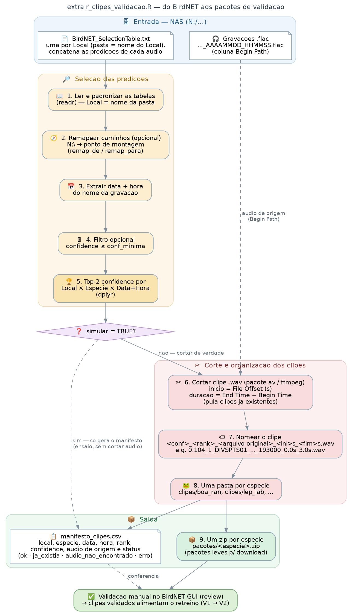

# Amostragem e validação de predições do BirdNET para PAM de anuros

> **EN** — R pipeline to build manually-validatable clip sets from BirdNET custom-classifier
> predictions in passive acoustic monitoring (PAM). It selects top-scoring predictions per
> site × species × night-hour, subsamples them under an explicit survey design (night window
> crossing midnight, alternate nights, species/hour-balanced quotas), cuts reproducible .wav
> clips, and — after manual review in the BirdNET GUI — returns precision-by-confidence
> curves, per-species threshold suggestions, a confirmed presence/absence-by-night table,
> and a clip list for classifier retraining. Developed for the FrogNet project
> (Pantanal/Cerrado, Brazil), but any BirdNET custom classifier output works.

Pipeline em R para gerar conjuntos de clipes de áudio validáveis manualmente a partir das
predições de um classificador customizado do BirdNET, no contexto de monitoramento acústico
passivo (PAM). Desenvolvido para o projeto **FrogNet** (anuros do Pantanal e Cerrado, MS,
Brasil), como base para conjuntos-teste de treino/validação de modelos locais — em primeira
instância para a tese de doutorado da Daiene (UFMS) e para o pipeline de validação do
FrogNet, mas desenhado para funcionar com a saída de qualquer classificador customizado
do BirdNET.



## O que o pipeline faz

**`extrair_clipes_validacao.R`** lê as `BirdNET_SelectionTable.txt` (formato Raven, uma
tabela concatenada por local), seleciona as *N* predições de maior confidence por
local × espécie × noite × hora, aplica o desenho amostral configurado e corta os clipes
`.wav` diretamente dos áudios originais, organizando **uma pasta por espécie** — pronta para
a aba *review* do BirdNET GUI — mais um zip por espécie ("pacotes" de validação leves para
download) e um `manifesto_clipes.csv` que liga cada clipe a local, espécie, data, noite,
hora, rank, confidence e áudio de origem.

O desenho amostral é todo declarativo, no bloco `config` do topo do script:

| Parâmetro | O que faz |
|---|---|
| `n_top` | Predições de maior confidence por local × espécie × noite × hora (padrão 2) |
| `conf_minima` | Confidence mínima para uma predição ser candidata (padrão 0.1) |
| `hora_inicio` / `hora_fim` | Janela de horas; cruzando a meia-noite (ex. 16 → 6), o agrupamento passa a ser por **noite** — a madrugada conta como a noite da véspera |
| `alternar_dias` | "Dia sim, dia não" sobre as noites, ancorado na 1ª noite de cada local |
| `meta_total` | Meta total de clipes por local, repartida de forma **balanceada** entre as espécies (water-filling: raras entram inteiras, o excedente é redistribuído) |
| `balancear_por_hora` | Round-robin entre as horas dentro de cada espécie (cobre o ciclo diel) |
| `especies` | Restringe a uma lista de códigos de espécie |
| `data_inicio` / `data_fim` | Janela de datas (ex.: período de um data logger) |
| `locais`, `max_por_especie`, `remap_de`/`remap_para`, `simular` | Filtro de locais, limite simples por espécie, remapeamento de caminhos e modo ensaio (só manifesto, sem cortar áudio) |

Todos os sorteios usam semente fixa, então re-execuções selecionam exatamente o mesmo
conjunto — e o script é **idempotente**: clipes já cortados são pulados, de modo que uma
rodada interrompida continua de onde parou. Áudios ausentes ou com erro de leitura não
derrubam a rodada; ficam marcados no manifesto (`status`).

**`pos_validacao.R`** fecha o ciclo depois da revisão manual no BirdNET GUI: classifica cada
clipe pelo caminho (subpastas `Positive`/`Negative`, padrões configuráveis), cruza com o
manifesto e produz (1) o veredito clipe a clipe, (2) a precisão por espécie × faixa de
confidence (+ figura), (3) o menor threshold de confidence que atinge uma precisão-alvo por
espécie, (4) a tabela de **presença confirmada por noite** (local × espécie × noite) e
(5) a lista de clipes positivos para o retreino do classificador.

**`diagrama_fluxo_validacao.R`** gera o fluxograma acima (DiagrammeR).

## Requisitos

R ≥ 4.2 (Windows, macOS ou Linux) e:

```r
install.packages(c("dplyr", "readr", "stringr", "purrr", "tidyr",
                   "av", "zip",          # extração (av embute o ffmpeg)
                   "ggplot2"))           # pos-validacao
```

## Uso

1. Edite o bloco `config` no topo de `extrair_clipes_validacao.R` (caminhos, desenho
   amostral). A tabela de seleção deve ter as colunas padrão do BirdNET/Raven:
   `Begin Time (s)`, `End Time (s)`, `Species Code`, `Confidence`, `Begin Path`,
   `File Offset (s)`; os áudios devem seguir o padrão `..._AAAAMMDD_HHMMSS` no nome.
2. Rode primeiro com `simular = TRUE` e confira o manifesto (quantos clipes, quais
   espécies, `status`); depois `simular = FALSE` para cortar de verdade.
3. Valide os clipes no BirdNET GUI (aba *review*).
4. Aponte `pos_validacao.R` para a pasta revisada e rode.

Exemplo de configuração usada no FrogNet (protocolo definitivo, ago/2026): janela
16h–6h, noites alternadas, `meta_total = 1500` por local, `conf_minima = 0.1` —
9.000 clipes de 6 locais, cortados em ~8 min/local num desktop comum.

## Estrutura de saída

```
<dir_saida>/
├── clipes/<especie>/*.wav      # prontos para o BirdNET GUI (review)
├── pacotes/<especie>.zip       # pacotes de validação para distribuir
├── manifesto_clipes.csv        # mapa completo clipe -> origem
└── resultados/                 # saidas de pos_validacao.R
```

## Autoria e citação

Desenvolvido por **Diogo B. Provete** (Universidade Federal de Mato Grosso do Sul), a partir
do desenho de protocolo de **Larissa S. M. Sugai** (Cornell Lab of Ornithology) e
**Liliana Piatti** (UFMS), no âmbito do projeto FrogNet. Código escrito com assistência de
IA (Claude, Anthropic), com revisão e testes humanos.

Se este código for útil no seu trabalho, cite o repositório (uma citação formal com DOI
poderá ser adicionada futuramente via release arquivada).

## Licença

[MIT](LICENSE) — use, adapte e redistribua à vontade, mantendo o aviso de copyright.
